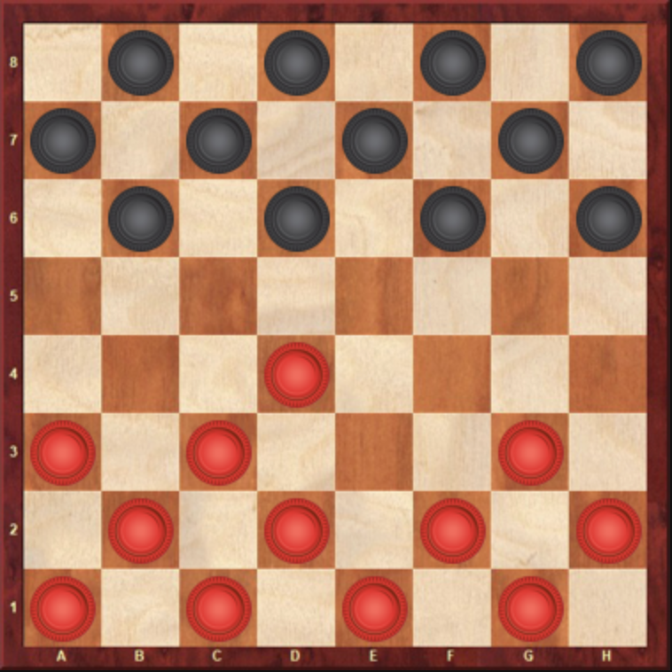

# PythonDraughts

**PythonDraughts** is a command line based and easy to use draughts engine coded with python (python 3).

In interactive notebook.
```python
import draughts

my_board = draughts.Board()
my_board.push("c3d4")
my_board.show()
```


