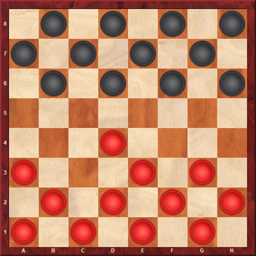

# PythonDraughts

**PythonDraughts** is an easy to use draughts engine coded with python (python 3).

```python
draughts.ipynb
---------------------------
import draughts

my_board = draughts.Board()
my_board.push("c3d4")
my_board.show()
---------------------------
```


